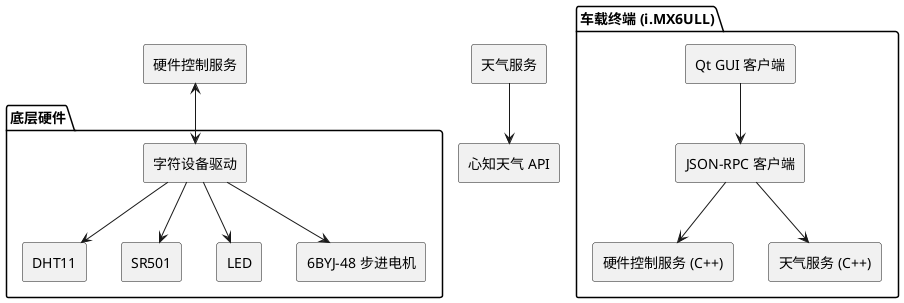

# 基于NXP i.MX6ULL的车载环境感知与智能控制终端  
**NXP i.MX6ULL In-Vehicle Environmental Perception and Intelligent Control Terminal (Qt + RPC)**

[](https://opensource.org/licenses/MIT)
[](https://www.openeuler.org)

---

## 项目简介

本项目基于 **NXP i.MX6ULL** 处理器，独立从**驱动层 → 服务层 → Qt GUI** 完成全栈开发，打造了一套**车载边缘实时环境感知与智能控制终端**。

系统融合温湿度传感器、人体接近感应、LED照明及步进电机执行机构，实现**车内环境实时监测 + 外部天气联动 + 乘员接近智能唤醒**功能，完美适配智能座舱（IVI）、车载信息娱乐系统或智能后装设备。

支持**高实时性、低功耗、多线程并发**，并通过**统一驱动接口 + JSON-RPC** 实现上下层解耦，具备极强的二次开发和扩展能力。

---

## 核心功能特性

- ✅ **实时环境感知**：DHT11 温湿度 + SR501 人体接近感应
- ✅ **智能控制执行**：LED 氛围灯 + 6BYJ-48 步进电机（模拟通风/遮阳帘）
- ✅ **天气联动决策**：对接心知天气 API，实现高温自动通风、低温提示等智能调节
- ✅ **Qt 现代化 GUI**：温湿度曲线、天气动态、控制面板、用户认证多屏交互
- ✅ **高并发通信**：JSON-RPC + Socket 多线程服务，RPC 硬件控制 + 天气服务分离
- ✅ **本地数据持久化**：SQLite 用户认证与偏好设置
- ✅ **完整底层驱动**：自主编写 Linux 字符设备驱动 + 设备树 GPIO 配置，支持中断触发
- ✅ **统一驱动抽象层**：ioctl 接口封装，简化上层应用开发

---

## 系统架构图（PlantUML）



## 技术栈

| 层级 | 技术 |
|---|---|
| 应用层 | Qt5/6（GUI + Designer）、QSS |
| 服务层 | C++11/14、JSON-RPC、libcurl、SQLite、多线程、Socket |
| 驱动层 | Linux 字符设备驱动、设备树、GPIO 子系统、中断处理 |
| 硬件 | NXP i.MX6ULL、DHT11、SR501、6BYJ-48、LED |
| 外部 | 心知天气 API |

---

### 硬件平台要求

**主控：**  
NXP i.MX6ULL（或兼容的 i.MX6ULL 开发板，如百问网、野火、正点原子）

**系统：**  
openEuler / Ubuntu 20.04+（ARM64）

**外设：**

- DHT11（温湿度传感器）
- SR501（人体红外感应）
- 6BYJ-48 步进电机 + ULN2003 驱动板
- LED（GPIO直驱）
- 电阻、电容、杜邦线若干

---

## 快速开始

### 1. 环境准备

```bash
安装依赖（openEuler / Ubuntu）
sudo apt update


sudo apt install build-essential cmake qtbase5-dev qt5-qmake qttools5-dev-tools libsqlite3-dev libcurl4-openssl-dev
